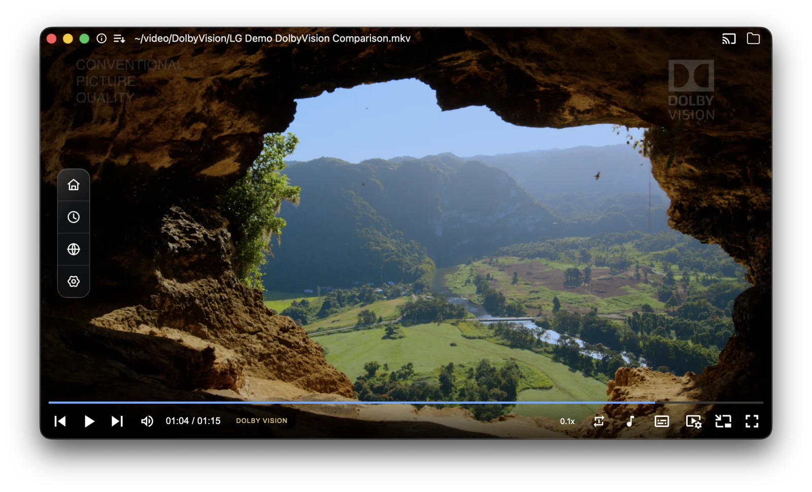
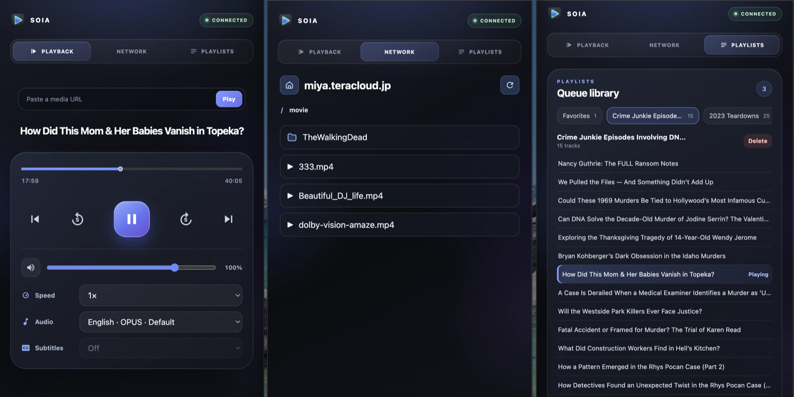
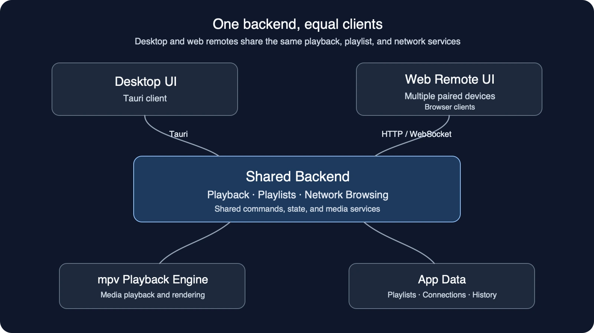

<h1 align="center">
  
  <br>
  Soia
  <br>
</h1>

<p align="center">
🎬 HDR & Dolby Vision · 🌐 WebDAV + DLNA + SMB Streaming · 📱 Web Remote Controller
</p>

<p align="center">
<b><a href="https://github.com/FengZeng/soia/releases">⬇️ Download Latest Release</a> · <a href="https://github.com/FengZeng/soia/issues">🐞 Report a Bug</a></b>
</p>



**Soia** brings local files, online video, and network media together in one fast, elegant, cross-platform experience. It’s built for modern media playback, with Dolby Vision support on macOS and Windows, reliable YouTube playback, seamless home-server streaming, living-room casting, and browser-based remote control.

---

## Why Soia?

### 1. Dolby Vision on macOS and Windows

Enjoy Dolby Vision playback on macOS and Windows.

<sub style="padding-left: 2em;">*Dolby Vision is not currently supported on Linux.*</sub>

### 2. Enhanced YouTube playback

- Import a YouTube playlist into Soia as a native playlist.
- Some links that do not play in other mpv-based players may still work in Soia.
- Parallel downloads help keep online playback smooth, especially on less stable connections.

### 3. Stream from your network library

Browse and play video streams from DLNA, SMB/Samba, and WebDAV sources without first downloading them to your computer.

### 4. Cast what you are watching

Cast the currently playing video — whether it is a local file or an online or network stream from DLNA, SMB, WebDAV, or YouTube — to a DLNA receiver or Chromecast device.

> **Note:** Keep Soia running while casting. Soia relays the media stream between the source and the receiver.

### 5. A browser-based remote controller

Scan a QR code to connect a phone or another browser in seconds. The remote controller supports:

- Basic playback controls such as play, pause, seek, and volume
- Playlist browsing and playback
- Network browsing and playback
- Audio and subtitle track selection

Enable Remote Controller in Settings, then show its QR code there or from the playback context menu to pair and connect. Multiple remote devices can control the same player together.



#### Under the hood

The desktop app and web remote are two clients of the same playback backend. The remote can also continue network browsing from the folder last opened in the desktop app.



## More playback tools

- Picture in Picture (PiP) on macOS and Windows
- Dual subtitles for bilingual viewing
- Fuzzy subtitle matching for local and network media
- Online subtitle search via OpenSubtitles and SubSource
- Advanced subtitle appearance controls for font, color, size, and position
- Custom shaders for high-quality scaling and rendering
- M3U (IPTV) parsing and playback
- Smart buffering with real-time speed indicators
- Resume playback with history tracking

---

## Install

Download from the [release page](https://github.com/FengZeng/soia/releases).

On macOS, you can install it with Homebrew:

```bash
brew tap FengZeng/soia
brew install --cask soia
```

On Windows, you can install it with WinGet:

```powershell
winget install soia
```

Or you can build it yourself. Soia supports macOS 13+, Windows, and Linux.
Linux builds have been tested on Ubuntu and Fedora Wayland sessions (`X11` is not currently supported).

## FAQ

Q: macOS says "Soia is damaged and can't be opened" or cannot verify it is free of malware.

A: This happens because the app is not yet signed with an Apple Developer ID certificate, so macOS may block it on first launch.

Easy fix (recommended):
1. Right-click Soia.app
2. Click "Open"
3. Click "Open" again in the dialog

If that doesn't work, run:
```bash
sudo xattr -r -d com.apple.quarantine /Applications/Soia.app
```

You can also go to System Settings -> Privacy & Security and click "Open Anyway" (it appears after a blocked launch attempt).

The app is open-source and its code is publicly available for anyone to inspect.

## Tech Stack

- Frontend: Vue 3 + TypeScript + Vite
- App runtime: Tauri v2
- Backend: Rust
- Playback engine: libmpv
- Persistence: SQLite (`media.db`) + JSON state files

## Getting Started

1. Prerequisites

   Ensure you have the following installed:

   - Node.js 18+ & pnpm 10.x
   - Rust (stable toolchain)
   - Tauri build prerequisites for your specific platform

2. Setup

   ```bash
   # Automatically prepares runtime libs
   pnpm install
   ```

3. Run

   ```bash
   # Launches with auto-injected library paths
   pnpm tauri dev
   ```

## Build and Bundle

Common release build commands:

```bash
pnpm bundle:mac:release
pnpm bundle:linux:release
pnpm bundle:win:release
```

## Keyboard Shortcuts

- `Space`: play/pause
- `Left / Right`: seek backward/forward (step from settings)
- `I`: toggle playback info panel
- Double-click video area: toggle fullscreen
- Middle-click during playback: hide or show controls; mouse movement stays suppressed for 3 seconds after hiding

## Data Storage

App data is stored in Tauri's local app data directory and includes:

- `media.db`: playlists, playlist entries, playback history, and local installation/device metadata
- `state.json`: UI state and preferences
- `network_connections.json`: saved network connections
- `thumbnails/`: captured artwork for Now Playing

## Security Note

Saved network credentials are currently persisted in `network_connections.json` as plain text. Avoid using sensitive production credentials on shared machines.

## Troubleshooting

- If a Linux build fails with `glib-2.0` / `gdk-3.0` / `*.pc` not found, install the Ubuntu dependencies:

```bash
sudo apt update
sudo apt install -y \
    build-essential \
    curl \
    wget \
    file \
    libgtk-3-dev \
    libayatana-appindicator3-dev \
    librsvg2-dev \
    pkg-config \
    libwebkit2gtk-4.1-dev
```

- Linux runtime note: current bundle targets Ubuntu Wayland sessions only; launching under pure `X11` is not supported.

- If build fails with `Cannot find libmpv`, run:

```bash
pnpm setup:libs
```

- If `pnpm setup:libs` fails, confirm release access to:
  - `https://github.com/FengZeng/mpv/releases/tag/v0.41.0-r17`
  - or set `MPV_RELEASE_ASSET_URL` to a direct asset URL and retry.

- If Linux/Windows bundle scripts report missing runtime manifest, generate it on the target platform:

```bash
pnpm sync:runtime:linux
pnpm sync:runtime:win
```

- If you have a local bundled `mpv + dependencies` directory for dev testing, use:

```bash
pnpm setup:libs /absolute/path/to/mpv-bundle
```

---

## License

This project is licensed under the GNU General Public License v3.0 only (`GPL-3.0-only`).
See [`LICENSE`](LICENSE) for the full text.
